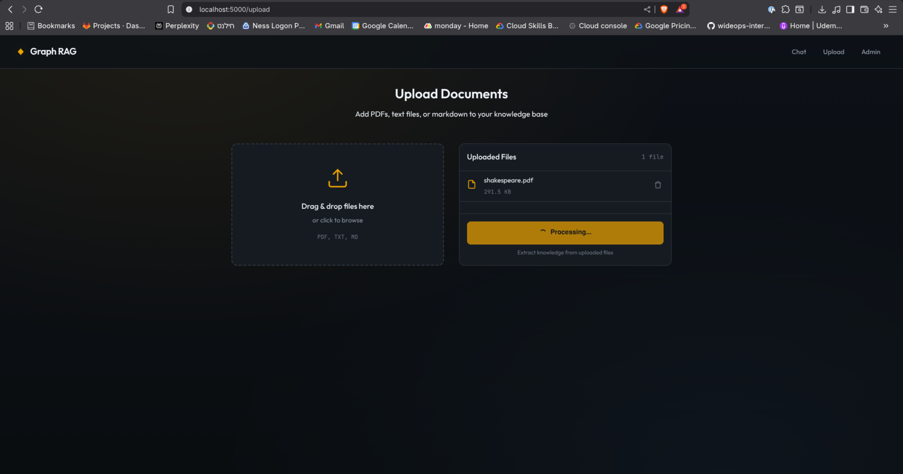
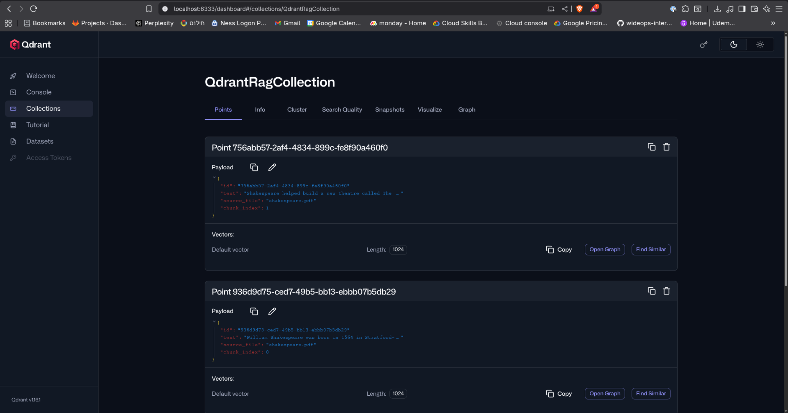
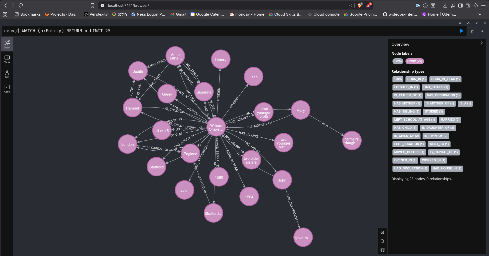
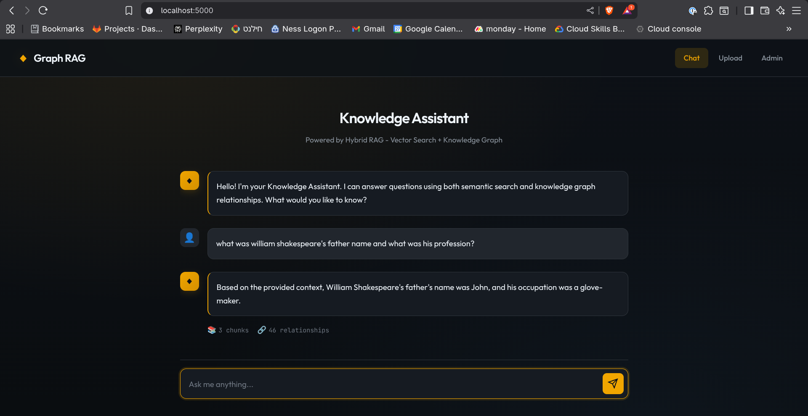

# GraphRAG: Agentic Hybrid RAG System

[](https://opensource.org/licenses/MIT)
[](https://www.python.org/downloads/)
[](https://kubernetes.io/)
[](https://helm.sh/)
[](https://fastapi.tiangolo.com/)
[](https://flask.palletsprojects.com/)
[](https://www.langchain.com/)
[](https://github.com/BerriAI/litellm)


A production-grade, **LLM-agnostic Hybrid RAG (Retrieval-Augmented Generation)** system designed for flexibility, scalability, and unbiased data retrieval. By combining vector similarity search (Qdrant) with knowledge graph relationships (Neo4j), GraphRAG delivers superior context awareness and reduced hallucinations compared to traditional RAG approaches.

<!-- IMAGE: Architecture Overview -->


---

## 🚀 Motivation

### Democratizing Advanced RAG
This project was born from a desire to make enterprise-grade Agentic RAG accessible to small businesses and individuals who may lack the budget for extensive infrastructure or costly LLM tokens. My goal was to engineer a system that is completely **LLM-agnostic**, allowing users to seamlessly switch between cost-effective local models (via Ollama), high-performance cloud APIs (like Gemini or GPT), and emerging open-source alternatives with a simple configuration change. This flexibility ensures powerful knowledge retrieval without vendor lock-in or prohibitive costs.

### The Power of Hybrid Retrieval
Traditional RAG systems often struggle with "flattened" knowledge—missing the complex web of relationships between entities. GraphRAG bridges this gap:
*   **Vector Search (Qdrant):** Captures semantic meaning and fuzzy similarities (e.g., understanding that "vehicle" and "car" are related).
*   **Knowledge Graph (Neo4j):** Enforces strict factual relationships and temporal logic (e.g., `(Person A)-[PRESIDENT_OF]->(Country B)`).

### Mitigating Bias & Hallucination
LLMs are biased by their training data. For example, if a model was trained mostly on data from 2008-2016, it might statistically associate "US President" more strongly with a past figure than the current one.
In this system, the **Knowledge Graph acts as a source of truth**. Even if the LLM's internal weights are biased, the retrieved graph relationship `(Current_President)-[CURRENTLY_HOLDS_OFFICE]->(USA)` overrides the model's training, ensuring factual accuracy.

---

## ✨ Features

*   **Hybrid Retrieval Engine:** Simultaneously queries vector and graph databases to synthesize answers.
*   **LLM Agnostic:** Switch between Local (Ollama) and Cloud (Gemini, OpenAI, Anthropic) models instantly via `values.yaml`.
*   **Agentic Workflow:** The LLM "Agent" intelligently decides when to use retrieval tools and how to structure queries.
*   **Multi-Modal Ingestion:** Supports PDF, Markdown, and Text files with automatic chunking and embedding.
*   **Production-Ready Infrastructure:** Fully containerized with Docker, orchestrated by Kubernetes (Kind), and managed via Helm.
*   **Structured Output:** Enforces JSON schema compliance for entity extraction, ensuring reliable graph construction.

---

## 🏗️ Roadmap

The following features are planned for future releases to enhance the system's capabilities:

*   **Contextual Awareness & Memory Persistence:** Implementing long-term memory (per user session) and short-term working memory to allow the agent to retain context across multi-turn conversations.
*   **Framework-Agnostic Agent Architecture:** Migrating the agentic core to **LangChain** or **LangGraph** to further decouple the logic from specific LLM providers and enable more complex reasoning chains.
*   **Multi-Modal Support (Image Embedding):** Integrating vision models (e.g., CLIP) to support image ingestion and retrieval, allowing users to query visual data alongside text and graphs.

---

## 🛠️ Prerequisites

To run this system locally, ensure your environment meets the following requirements:

### Hardware
*   **RAM:** 16GB minimum (required to run Kubernetes, Vector DB, Graph DB, and Local LLMs simultaneously).
*   **Disk:** 20GB+ free space for container images and data volumes.

### Software Tools
*   **Docker:** Container runtime.
*   **Kind (Kubernetes in Docker):** For creating a local K8s cluster.
*   **Kubectl:** Kubernetes command-line tool.
*   **Helm:** Kubernetes package manager.
*   **Make:** For running automation scripts.

---

## ⚡ Quick Start

### 1. Clone the Repository
```bash
git clone https://github.com/your-username/graph-rag.git
cd graph-rag
```

### 2. Configure Your Model (Optional)
By default, the system uses `gemini/gemini-2.5-pro` (requires API key) or a local Ollama model.
To set your API key or change the model, edit `deploy/charts/graph-rag/values.yaml`:

```yaml
ragApi:
  config:
    # Example for Google Gemini
    llmModel: "gemini/gemini-2.5-pro"
    llmApiKey: "YOUR_GOOGLE_API_KEY_HERE"
```
*See [Configuration](#-configuration) for more details.*

### 3. Start the System
Run the automated setup script. This will create a Kind cluster, build all Docker images, install the Helm chart, and wait for pods to be ready.

```bash
make start
```
*☕ Grab a coffee—this takes a few minutes on the first run as images are built and downloaded.*

### 4. Access the Web UI
Once the terminal confirms the system is running:
*   Open your browser to: **[http://localhost:30080](http://localhost:30080)**
*   Upload a document (PDF, TXT, MD) via the "Upload" tab.
*   Switch to "Chat" and ask questions about your data!



### 5. Shutdown
To stop the cluster and remove all resources:
```bash
make clean
```

---

## ⚙️ Configuration

GraphRAG is designed for extreme configurability. All major settings are centralized in `deploy/charts/graph-rag/values.yaml`.

### Switching LLMs
You can use **any** model supported by [LiteLLM](https://docs.litellm.ai/docs/providers), provided it supports **Structured JSON Output**.

**To use a Local Model (Ollama):**
1.  Ensure the model is pulled or available in Ollama.
2.  Update `values.yaml`:
    ```yaml
    ragApi:
      config:
        llmModel: "ollama/qwen2.5:14b"  # Must support JSON mode
        llmApiKey: ""                   # Not needed for local
    ```

**To use a Cloud Model (e.g., Gemini):**
```yaml
ragApi:
  config:
    llmModel: "gemini/gemini-2.5-pro"
    llmApiKey: "AIzaSy..."
```
*Reference: See [Available_LLMs.md](Available_LLMs.md) for a list of tested models.*

### Switching Embedding Models
If you change the embedding model, you **MUST** update the vector dimension size in two places to match the new model's output.

```yaml
# deploy/charts/graph-rag/values.yaml

ragApi:
  config:
    embeddingModel: "ollama/mxbai-embed-large:335m"
    embeddingDimension: 1024  # <--- Update this (e.g., 768 for nomic-embed-text)

qdrant:
  collection:
    vectorSize: 1024          # <--- MUST match embeddingDimension
```

---

## 🏗️ Architecture

The system operates as a microservices architecture on Kubernetes:

1.  **Ingestion Pipeline:**
    *   **User** uploads file (Web UI) → Saved to Shared Volume (`raw_data`).
    *   **RAG API** picks up file → **Docling** parses content.
    *   **Text Splitter** chunks text.
    *   **Embedding Model** converts chunks to vectors → Stored in **Qdrant**.
    *   **LLM** extracts Entities & Relationships → Stored in **Neo4j**.





2.  **Retrieval Pipeline:**
    *   **User** asks question (Web UI) → **RAG API**.
    *   **Agent** determines intent.
    *   **Vector Search** finds top-K relevant chunks.
    *   **Graph Search** traverses relationships from key entities.
    *   **Synthesis** combines all context to generate the final answer.



---

## 📂 Project Structure

```text
graph_rag/
├── Makefile                 # One-click commands (start, stop, logs)
├── deploy/
│   ├── charts/graph-rag/    # Helm Chart (The "Infrastructure as Code")
│   │   ├── values.yaml      # CENTRAL CONFIGURATION FILE
│   │   └── templates/       # K8s deployment manifests
│   └── kind-config.yaml     # Local cluster config
├── services/
│   ├── rag_api/             # The Brain (FastAPI)
│   │   ├── src/core/        # Agent logic, config, retrieval engine
│   │   ├── src/ingest/      # Parsing, chunking, graph extraction
│   │   └── src/storage/     # DB connectors (Neo4j, Qdrant)
│   ├── web_ui/              # The Face (Flask, HTML/JS)
│   └── ollama/              # Local LLM Service (Custom image)
├── raw_data/                # Shared storage for uploaded files
└── Available_LLMs.md        # Reference for supported models
```

---

## 🧰 Technologies Used

| Component | Technology | Description |
| :--- | :--- | :--- |
| **Orchestration** | Kubernetes (Kind), Helm | Container management and deployment |
| **Backend** | Python 3.10+, FastAPI | High-performance API handling |
| **Frontend** | Flask, Jinja2, Bootstrap | User interface for chat and uploads |
| **Vector DB** | Qdrant | Semantic search engine |
| **Graph DB** | Neo4j | Knowledge graph storage |
| **LLM Interface** | LiteLLM | Unified interface for 100+ LLM providers |
| **Embeddings** | Ollama | Local embedding generation |
| **Processing** | Docling, LangChain | Document parsing and text splitting |

---

## ❓ Troubleshooting

**Q: The Web UI isn't loading.**
A: Check if the pods are ready with `kubectl get pods`. If they are running, ensure port 30080 is not blocked on your machine.

**Q: "Hallucination" or wrong answers?**
A: Ensure you are using a capable LLM. Smaller models (like 3B params) struggle with the complex reasoning required for RAG. We recommend at least **Qwen 2.5 14B** (Local) or **Gemini 1.5/2.5 Pro** (Cloud).

**Q: Ingestion is failing.**
A: Check the `rag-api` logs: `kubectl logs deployment/rag-api`. Ensure your file type is supported and not corrupted.

---

## 📄 License

This project is licensed under the **GraphRAG Small Business License 1.0**:

- **Free use** for individuals and small businesses (fewer than 250 employees or less than USD 10M annual revenue), including commercial use.
- **Enterprise users** (above those thresholds) must obtain a separate commercial license by contacting the author before using this project in production or as part of a product.

See the [LICENSE](LICENSE) file in this repository for the full legal text.
